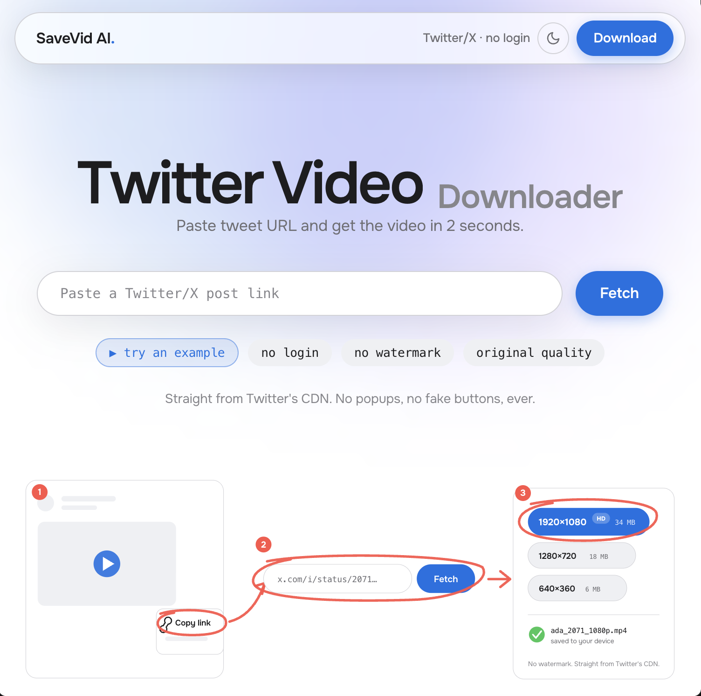

# SaveVid AI

<p align="center">
  <a href="https://x.com/israfill"></a>
  <a href="https://github.com/OxIsrafil/savevidai/stargazers"></a>
  <a href="LICENSE"></a>
</p>



Twitter/X video downloader with none of the garbage. Paste a post link, see a preview,
pick a quality, download. No popups, no redirects, no fake download buttons, no tracking.

**Live site:** https://savevidai.israfill.dev

## Why another downloader

Every existing Twitter video downloader is buried in popunders and fake buttons.
SaveVid AI is the opposite: open source, one passive ad slot at most (off by default),
and the download is never gated or delayed. Tweet metadata is resolved via the FixTweet
API; the video itself is streamed through a locked-down proxy (Twitter's CDN refuses
cross-origin browser reads), which is what makes the in-page progress bar and clean
filenames possible.

## Features

- All available qualities with file sizes, best-first
- Preview card (author, text, thumbnail, duration) before you download
- Multi-video tweets and GIFs supported
- Clean filenames: `handle_tweetid_1080p.mp4`
- Keyboard-first: paste anywhere on the page and it just fetches
- Dark and light themes, fast, accessible, no cookies

## Self-host

```bash
docker run -p 8000:8000 ghcr.io/oxisrafil/savevidai:latest
```

Open http://localhost:8000. That's the whole setup.

Or deploy your own: use `render.yaml` (free tier) or `compose.yaml` + `Caddyfile`
on any VPS (edit the domain in the Caddyfile).

## Development

```bash
# backend
cd backend && python3.12 -m venv .venv && source .venv/bin/activate
pip install -e '.[dev]' && pytest -q
uvicorn app.main:app --reload --port 8000

# frontend (second terminal)
cd frontend && npm install
npm run dev   # proxies /api to :8000
npm test -- --run
```

Live smoke test: `BASE_URL=http://localhost:8000 TWEET_URL=<public tweet with video> python scripts/smoke.py`

## When extraction breaks

SaveVid AI resolves videos through the FixTweet public API (`api.fxtwitter.com`),
with `api.vxtwitter.com` as a fallback, because Twitter closed anonymous video
access to yt-dlp. If resolving stops working, first check whether FixTweet itself
is up, then check whether their JSON shape changed (`backend/app/extractor.py`
maps it). Run the smoke test to confirm. See CONTRIBUTING for details.

## Traffic stats without tracking

There is no client-side analytics. On the VPS, Caddy writes a JSON access log;
run `goaccess /data/access.log --log-format=CADDY` for visitor counts.

## License

MIT

---

<p align="center">
  <b>SaveVid AI<span>.</span></b><br/>
  built by <a href="https://x.com/israfill"><b>@israfill</b></a> ·
  <a href="https://github.com/OxIsrafil">GitHub</a> ·
  <a href="https://savevidai.israfill.dev">savevidai.israfill.dev</a><br/>
  <sub>If this saved you from a popup hell site, drop it a star</sub>
</p>
